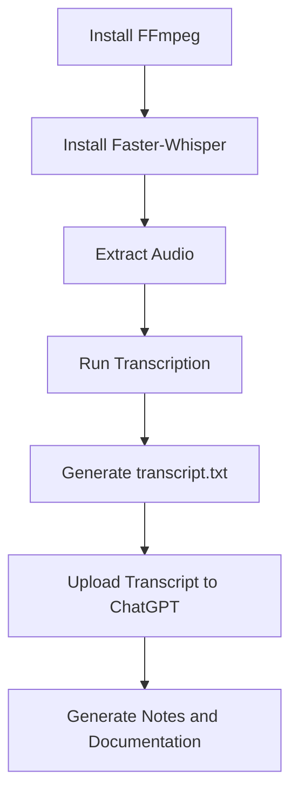

# Local Video Transcription Knowledge Base

> A practical guide for transcribing large training videos locally using OpenAI Whisper and Faster-Whisper.

---

# Overview

This guide explains how to transcribe large training videos locally using OpenAI Whisper and Faster-Whisper.

## Supported Output Formats

- TXT
- SRT
- VTT
- JSON

### Recommended Output

```text
transcript.txt
```

---

# Environment

Current setup:

| Component | Value |
|------------|------|
| OS | Windows |
| RAM | 8 GB |
| Processing | CPU |
| Input | MP4 |
| Output | TXT |
| Recommended Engine | Faster-Whisper |
| Recommended Model | Base |
| Compute Type | int8 |

---

# Installing OpenAI Whisper

Install:

```bash
pip install openai-whisper
```

Verify:

```bash
whisper --help
```

---

# Installing Faster-Whisper

Recommended because it is significantly faster.

```bash
pip install faster-whisper
```

Benefits:

- Faster than original Whisper
- Lower RAM usage
- Better CPU performance
- Supports GPU acceleration

---

# Installing FFmpeg

Whisper requires FFmpeg.

Using Winget:

```bash
winget install Gyan.FFmpeg
```

Close PowerShell and open a new session.

Verify:

```bash
ffmpeg -version
```

Example output:

```text
ffmpeg version 8.x
```

---

# Original Whisper

## Medium Model

```bash
whisper "video.mp4" --model medium --language English
```

### Pros

- High accuracy

### Cons

- Extremely slow on CPU
- Not recommended for 8 GB RAM

---

# Smaller Models

## Small

```bash
whisper "video.mp4" --model small --language English
```

Advantages:

- Good accuracy
- Faster

---

## Base

```bash
whisper "video.mp4" --model base --language English
```

Advantages:

- Much faster
- Recommended for long recordings

---

## Tiny

```bash
whisper "video.mp4" --model tiny --language English
```

Advantages:

- Very fast

Disadvantages:

- Lower accuracy

---

# Model Comparison

| Model | Speed | Accuracy | Recommended |
|---------|------|----------|------------|
| Tiny | ⭐⭐⭐⭐⭐ | ⭐⭐ | Quick drafts |
| Base | ⭐⭐⭐⭐ | ⭐⭐⭐⭐ | ✅ Best choice |
| Small | ⭐⭐⭐ | ⭐⭐⭐⭐ | Good balance |
| Medium | ⭐⭐ | ⭐⭐⭐⭐⭐ | Powerful CPU only |
| Large | ⭐ | ⭐⭐⭐⭐⭐ | GPU preferred |

---

# Faster-Whisper (Recommended)

Install:

```bash
pip install faster-whisper
```

Benefits:

- Faster than original Whisper
- Lower RAM usage
- Better CPU performance
- Supports GPU acceleration

---

# Complete Python Script

Save as:

```text
transcribe.py
```

```python
from faster_whisper import WhisperModel

video_file = r"C:\Users\VSP\Downloads\DAY1\exp\Recording_ Kubernetes_ 19- 23 May_ Sonal - Day 1.mp4"

model = WhisperModel(
    "base",
    device="cpu",
    compute_type="int8"
)

segments, info = model.transcribe(
    video_file,
    language="en",
    beam_size=1
)

with open("transcript.txt", "w", encoding="utf-8") as f:
    for segment in segments:
        f.write(segment.text.strip() + "\n")

print("Transcript saved")
```

Run:

```bash
python transcribe.py
```

---

# Output

Produces:

```text
transcript.txt
```

Example:

```text
Welcome everyone.
Today we are going to discuss Kubernetes architecture.
The control plane consists of API Server, Scheduler, etcd and Controller Manager.
```

---

# Extract Audio First (Recommended)

Extract audio from MP4:

```bash
ffmpeg -i "video.mp4" -vn -ac 1 -ar 16000 audio.wav
```

Then use:

```python
video_file = r"C:\Path\audio.wav"
```

Advantages:

- Faster processing
- Reduced decoding overhead

---

# Performance Tuning

CPU + 8 GB RAM

Recommended:

```python
WhisperModel(
    "base",
    device="cpu",
    compute_type="int8"
)
```

Avoid:

```python
WhisperModel("medium")
```

Increase speed:

Lower beam size:

```python
beam_size=1
```

Default:

```python
beam_size=5
```

Lower beam size = faster.

---

# GPU Acceleration

NVIDIA GPU:

```python
WhisperModel(
    "base",
    device="cuda",
    compute_type="float16"
)
```

Speed improvements:

- 5x–20x faster

---

# Troubleshooting

## FileNotFoundError

Cause:

FFmpeg missing.

Fix:

```bash
winget install Gyan.FFmpeg
```

Verify:

```bash
ffmpeg -version
```

---

## PATH Issue

Installer message:

```text
Path environment variable modified.
```

Restart your shell.

Fix:

Close PowerShell and reopen.

---

## Video Not Found

Check:

```bash
dir *.mp4
```

Use exact filename.

---

## CPU Warning

```text
FP16 is not supported on CPU; using FP32 instead
```

This is normal.

Ignore it.

---

## Slow Processing

Cause:

Medium model on CPU.

Fix:

```python
WhisperModel("base")
```

or

```python
WhisperModel("small")
```

---

# Workflow



---

# Frequently Asked Questions

## Can Whisper process 500 MB videos?

Yes.

Even multi-GB videos are supported.

---

## Is Faster-Whisper better?

Yes.

Recommended.

---

## Which model should I use?

For 8 GB RAM:

```text
base
```

---

## Do I need a GPU?

No.

CPU works.

GPU simply improves speed.

---

## Which output format should I use?

```text
TXT
```

---

# Recommendations

✅ Use Faster-Whisper

✅ Use Base model

✅ Extract audio before transcription

✅ Use beam_size=1 for speed

✅ Generate transcript.txt

✅ Upload transcript into ChatGPT to generate:

- Study notes
- Interview questions
- Technical documentation
- GitHub Markdown pages