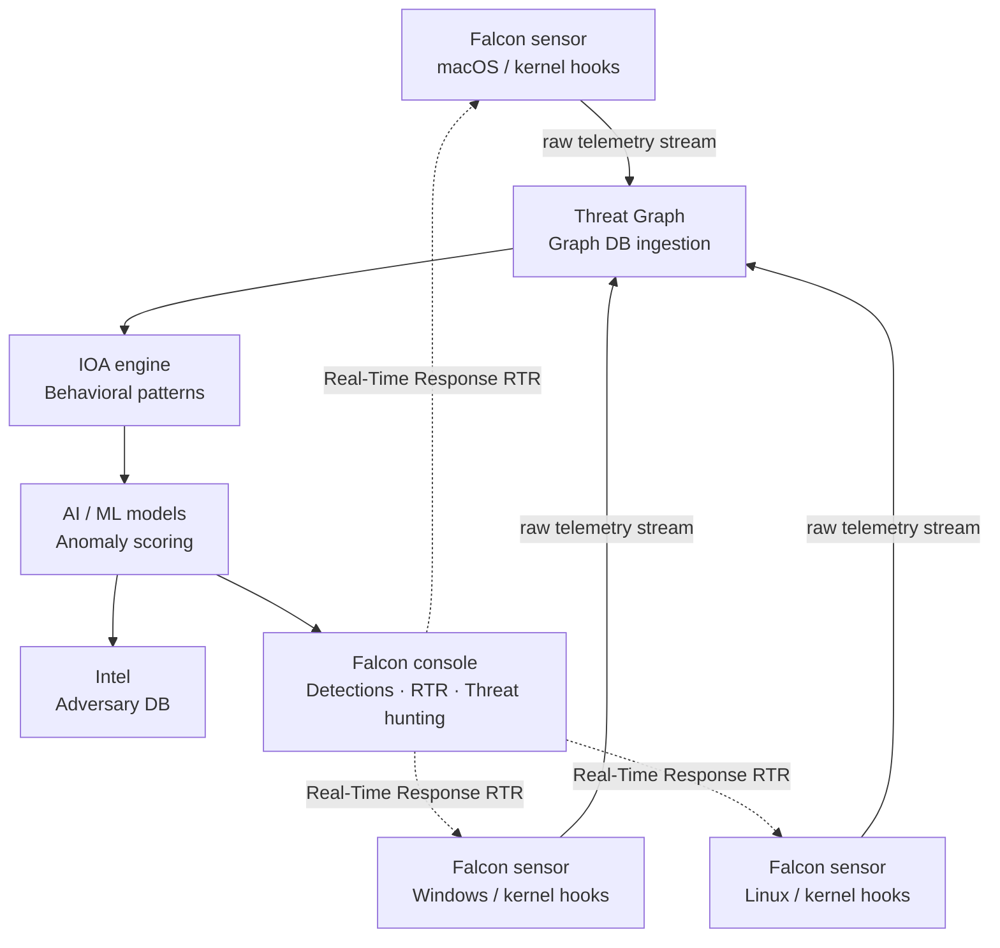
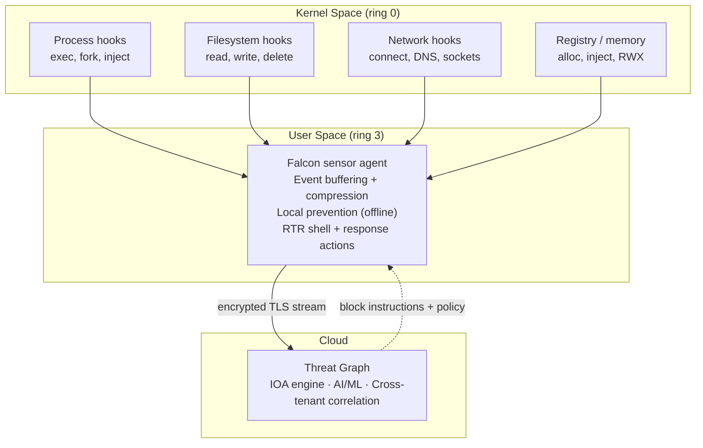
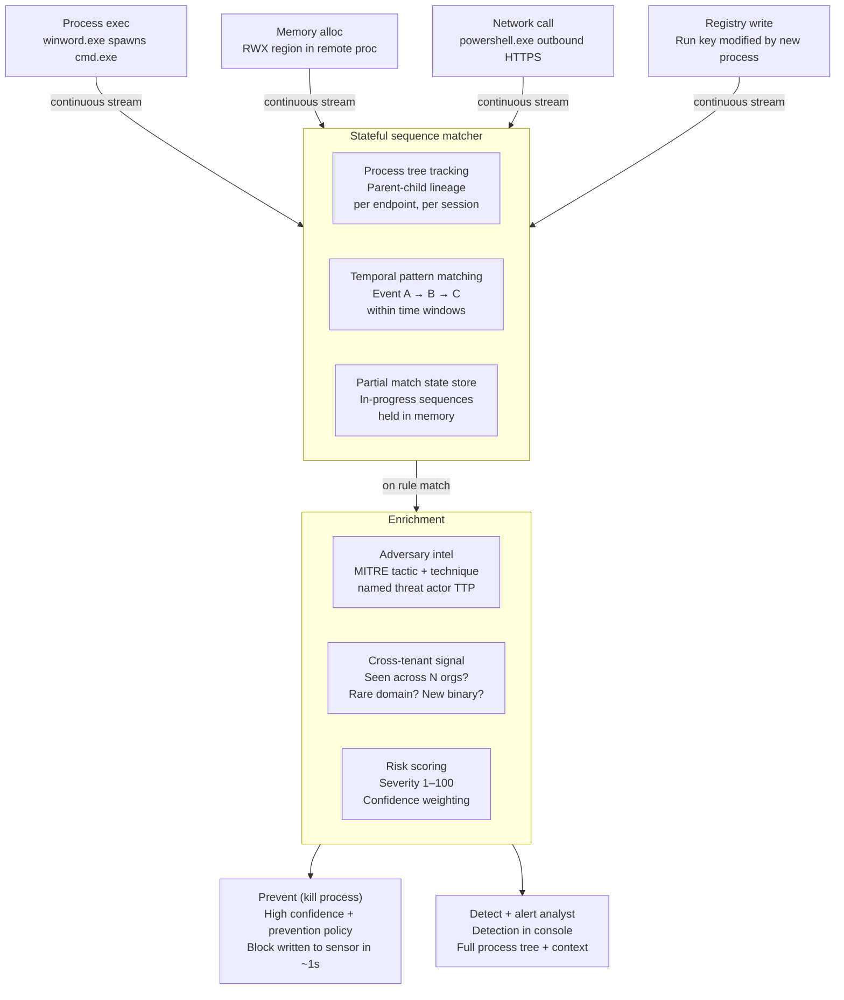
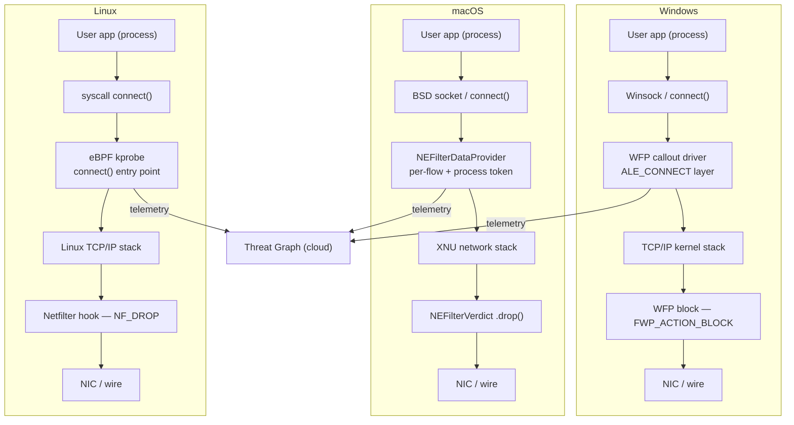
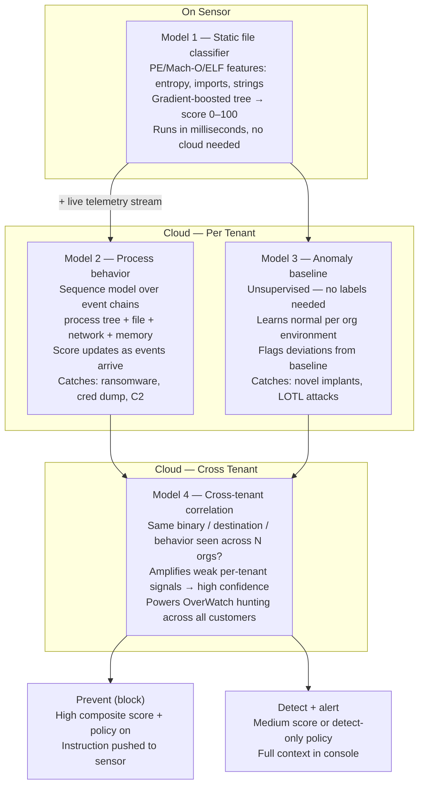
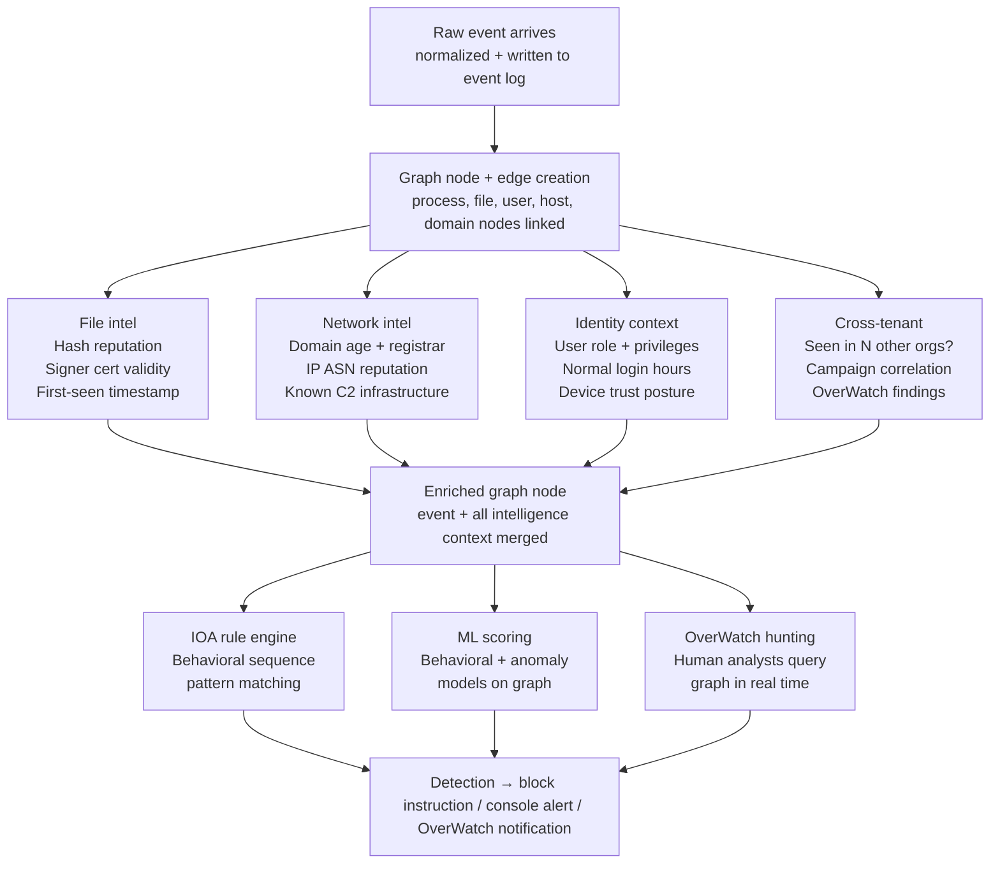
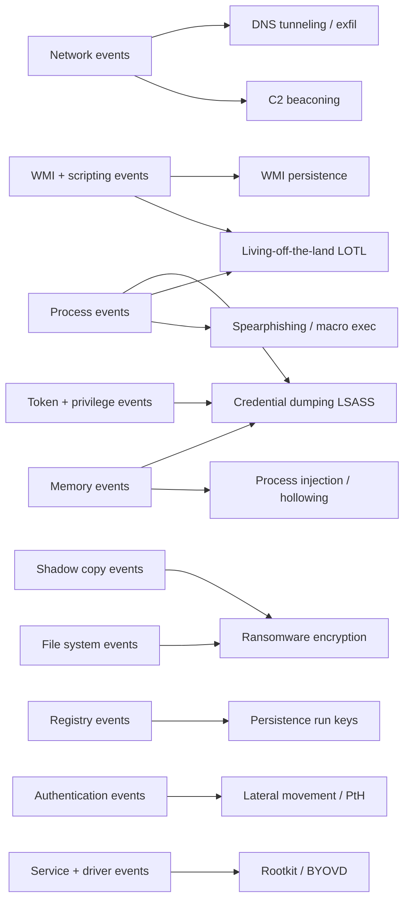

# CrowdStrike Falcon EDR: How It Works and Why It's Different

> A comprehensive technical deep-dive covering the sensor architecture, kernel-level interception, IOA behavioral detection, machine learning pipeline, Threat Graph, and full Windows event taxonomy.

---

## Table of Contents

1. [How CrowdStrike EDR Actually Works](#1-how-crowdstrike-edr-actually-works)
2. [The Falcon Sensor at Kernel Level](#2-the-falcon-sensor-at-kernel-level)
3. [The IOA Behavioral Detection Engine](#3-the-ioa-behavioral-detection-engine)
4. [Network Interception at Kernel Level](#4-network-interception-at-kernel-level)
5. [Machine Learning Detection Pipeline](#5-machine-learning-detection-pipeline)
6. [What Happens Inside the Threat Graph](#6-what-happens-inside-the-threat-graph)
7. [Windows Event Taxonomy](#7-windows-event-taxonomy)

---

## 1. How CrowdStrike EDR Actually Works

### Three Architectural Pillars

CrowdStrike Falcon is built on three components that differentiate it fundamentally from legacy security products.

#### 1.1 The Falcon Sensor (Single Lightweight Agent)

A kernel-level agent sits on every endpoint. Unlike legacy AV that hooks into specific OS APIs, Falcon instruments the kernel directly — capturing raw system calls, process creation events, network connections, file I/O, and registry operations *before* the OS can be manipulated. It streams all telemetry continuously to the cloud. The sensor is a data collector and enforcer, not an analyzer.

#### 1.2 Threat Graph (Cloud-Native AI Brain)

All telemetry flows into a massive cloud graph database correlating events across all CrowdStrike customers globally — billions of events per day. Machine learning models run on this graph to:

- Detect behavioral patterns (not just signatures)
- Correlate events across time (attacks spanning hours or days are stitched together)
- Share threat intelligence across the entire customer base in real time

#### 1.3 Indicators of Attack (IOA) — Behavior-Based Detection

Instead of asking "does this file look malicious?" (signature/hash matching), CrowdStrike asks "does this *sequence of behaviors* look like an attack technique?" This is why it catches fileless malware, living-off-the-land techniques, and zero-days that have no known signature.

### Architecture Overview



### How CrowdStrike Compares

| Dimension | Legacy AV | Microsoft Defender | SentinelOne | CrowdStrike Falcon |
|---|---|---|---|---|
| Detection method | Signature / hash | Signature + behavioral | AI behavioral | IOA behavioral + ML + human OverWatch |
| Agent weight | Heavy (local scanning) | Medium | Medium | Very light (streams to cloud) |
| Cross-customer intel | None | Limited | Limited | Full Threat Graph — all tenants |
| macOS / Linux parity | Poor | Poor | Good | Excellent |
| Adversary tracking | None | Limited | Limited | 200+ named adversary groups |
| Human threat hunting | None | Add-on | Add-on | OverWatch 24/7 built-in |
| Autonomous response | No | Partial | Strong | Strong + analyst-enriched |
| Response channel | None | OS-integrated | Agent | RTR — live kernel shell, no VPN |

### Unique Capabilities

**OverWatch** — a 24/7 human threat hunting team reviewing detections across all customers. When their models flag something unusual, human analysts dig in and push findings to affected organizations.

**Real-Time Response (RTR)** — live shell access to any enrolled endpoint globally, no VPN needed. Analysts can run commands, pull files, or remediate in real time from the console.

**Adversary tracking** — CrowdStrike names and tracks 200+ adversary groups. When a detection fires, it tells you *which* nation-state or criminal group's TTPs it matches, not just "generic malware."

**1-10-60 benchmark** — 1 minute to detect, 10 minutes to investigate, 60 minutes to remediate.

---

## 2. The Falcon Sensor at Kernel Level

### Operating at Ring 0

The Falcon sensor operates at **ring 0** (kernel space) — the most privileged execution level on any OS. This gives it visibility that user-space security tools cannot match: it sees events as they happen in the OS, before any user-mode process can tamper with or hide them.

| Platform | Mechanism | API / Framework |
|---|---|---|
| Windows | Kernel driver via official KPP-compatible interfaces | ETW providers, minifilter driver (filesystem), WFP (network) |
| macOS (10.15+) | System extension, user-space privileged process | Endpoint Security Framework (ESF) |
| macOS (pre-10.15) | Kernel extension | NKE socket filter, kext |
| Linux | In-kernel sandboxed programs | eBPF probes on syscalls + Netfilter |

**Key architectural insight:** The sensor doesn't analyze threats on-device. It captures and streams a rich event telemetry feed to the cloud. This is architecturally different from legacy AV, which does all scanning locally.

### Kernel Architecture



### What the Sensor Captures

**Process events** — every `exec()` / `CreateProcess()` call with full command-line arguments, parent-child process relationships, binary hash, and whether it was spawned from an unusual parent (e.g. Word spawning `cmd.exe`).

**Memory events** — allocations marked RWX (Read-Write-Execute), cross-process memory injection (`VirtualAllocEx` / `WriteProcessMemory`), reflective DLL loading. These are the signatures of fileless malware that never touches disk.

**Network events** — DNS queries and responses, raw socket creation, HTTP/S connections with the initiating process identified.

**Filesystem events** — file creation/modification/deletion including the process that triggered it, shadow copy deletions (ransomware tell), writes to sensitive locations.

**Registry events** — run key modifications (persistence), service creation, COM object hijacking attempts.

### The Critical Design Choice: Stream First, Analyze in Cloud

Legacy tools make a local allow/block decision at scan time. Falcon streams *everything* to the cloud and lets the Threat Graph do the analysis against a global corpus.

An attacker who constructs a binary that looks clean to local ML — low entropy, no known bad strings, clean imports — still has their *behavior* analyzed. If that binary runs, spawns `cmd.exe`, calls out to a rare domain, and starts enumerating files, the Threat Graph sees that behavioral sequence and matches it against known attack patterns even if each individual event looks benign.

The sensor carries a small local ML model for offline operation, but heavy analysis always happens in the cloud. This is also why Falcon adds only ~1-2% CPU overhead vs. the 10-15% drag from legacy AV scanners.

---

## 3. The IOA Behavioral Detection Engine

### IOA vs IOC — The Fundamental Distinction

| | IOC (Indicator of Compromise) | IOA (Indicator of Attack) |
|---|---|---|
| Question asked | Does this file/hash/IP match something known bad? | Does this *sequence of behaviors* look like an attack technique? |
| Timing | Reactive — after the fact | Proactive — catches attacks in progress |
| Novel malware | Misses it | Detects it |
| Fileless attacks | Misses it | Detects it |
| Zero-days | Misses it | Detects it |

### Behavioral Sequence Matching

IOA rules encode attacker techniques as **temporal sequences** — event A, followed by event B within a time window, under certain conditions. The engine doesn't care *what* the malware is — it cares *what it does*.

Example sequences:

```
Office app → spawns cmd.exe or powershell.exe → makes outbound connection
= Spearphishing with macro execution

Process → VirtualAllocEx into another process → WriteProcessMemory → CreateRemoteThread
= Process injection

Service created from unusual path → SYSTEM privileges → net user /add
= Lateral movement / persistence
```

No single step is necessarily malicious. It's the *chain* that triggers.

### Detection Pipeline



### The Stateful Sequence Engine

The trickiest engineering problem is maintaining state across millions of events per second. The IOA engine:

**Tracks partial matches** — if step 1 of a 4-step pattern fires, the engine holds that in memory and waits for steps 2, 3, 4. If they don't arrive within a time window, the partial match expires. This catches slow-burn attacks that unfold over hours.

**Tracks process lineage** — every process on every endpoint is tracked in a tree. A rule can say "PowerShell called from any Office application ancestor" rather than just "PowerShell running."

**Correlates across event types** — a single IOA rule might need a filesystem event, a network event, and a registry event all originating from the same process tree within a 60-second window.

### Why IOA Catches What Signatures Never Could

Consider a completely novel piece of malware — never seen before, no hash match. If it does any of these, IOA fires:

- Spawns an interpreter (cmd/PowerShell/wscript) from an unusual parent
- Reads LSASS memory (credential dumping)
- Creates a scheduled task or service for persistence
- Moves laterally using psexec patterns or WMI
- Deletes volume shadow copies (ransomware tell)
- Calls `net user /add` or modifies local admin group

### Custom IOA Rules

Custom IOA rules follow the same pipeline. When you create a rule to block software on specific machines:

1. Define the **process image** (executable path)
2. Define optional **conditions** (username, parent process, command-line regex)
3. Choose the **action** (prevent / detect only)
4. Scope to a **host group**

Per-user exceptions work by adding a condition: "match this pattern *unless* the executing user is in this list."

### Response Speed

When a high-confidence IOA match fires with prevention policy enabled:

1. Cloud sends a **blocking instruction** back to the sensor over the same persistent TLS connection — typically within 1–2 seconds
2. Sensor issues a **kernel-level process kill** before malicious behavior completes
3. Full process tree, event context, and fired rule are recorded in the Falcon console

For the most dangerous patterns (LSASS reads), the sensor blocks synchronously without waiting for the cloud round-trip.

---

## 4. Network Interception at Kernel Level

### The Core Challenge

Network interception must happen where:
1. **Process identity** is still attached to the traffic
2. The connection can be **blocked** before data leaves the machine
3. It is **tamper-resistant** — malware cannot unhook it

User-space interception fails condition 3. NIC-level packet capture fails condition 1. The kernel network stack is the only place satisfying all three simultaneously.

### Platform-by-Platform Breakdown

#### Windows: Windows Filtering Platform (WFP)

Falcon registers as a **WFP callout driver** — Microsoft's official kernel API for network inspection (same framework used by Windows Defender, firewalls, and VPN clients).

Key filter layers used:

| Layer | When it fires | What Falcon does |
|---|---|---|
| `FWPM_LAYER_ALE_CONNECT_V4/V6` | Moment a process calls `connect()` | Capture 5-tuple + process identity; optionally return `FWP_ACTION_BLOCK` |
| `FWPM_LAYER_ALE_FLOW_ESTABLISHED_V4/V6` | Connection fully established | Record for telemetry |
| `FWPM_LAYER_DATAGRAM_DATA_V4` | Per UDP datagram | Capture with process context |
| `FWPM_LAYER_ALE_RESOURCE_ASSIGNMENT` | DNS client queries | Full DNS visibility |

#### macOS: Endpoint Security Framework + Network Extension

- **ESF** provides `ES_EVENT_TYPE_NOTIFY_NETWORK_FLOW` — fired when a new network flow is created, with full process context (`audit_token`)
- **Network Extension** (`NEFilterDataProvider` / `NEFilterControlProvider`) runs in a privileged, Apple-signed process. Provides per-flow block capability via `NEFilterVerdict.drop()`

Pre-Catalina used a **Network Kernel Extension (NKE)** — a `kern_ctl` socket filter hooking directly into BSD socket layer in the XNU kernel.

#### Linux: eBPF + Netfilter

**eBPF probes** on `connect()`, `accept()`, `bind()`, `sendto()`, `recvfrom()` syscall entry/exit points via `kprobe` and `tracepoint` hooks. When any process calls `connect()`, the eBPF program fires *in the context of that process* — direct access to PID, UID, destination sockaddr, process name from task struct.

**Netfilter hooks** at `NF_INET_LOCAL_OUT` and `NF_INET_PRE_ROUTING` for blocking. Returns `NF_DROP` to discard or `NF_ACCEPT` to allow. Combined with eBPF process-context data, enables per-process, per-destination block decisions.

### Network Stack Interception Points



### Per-Connection Data Captured

At the interception point, Falcon records:

- **5-tuple**: source IP, source port, destination IP, destination port, protocol
- **Process context**: PID, process name, full executable path, parent process
- **DNS resolution**: hostname queried, IP resolved, TTL (very short TTLs = C2 indicator)
- **Connection outcome**: established, refused, timed out, or blocked
- **Timing**: precise timestamp used for beaconing detection

### DNS Intelligence

Beyond logging queries, the Threat Graph evaluates:

- **Domain age and reputation** — newly registered domains heavily weighted when contacted by unusual processes
- **DGA detection** — algorithmically generated domain names have statistical properties (low vowel frequency, high entropy) that ML detects
- **Subdomain abuse** — long random subdomains used for DNS tunneling
- **Beaconing patterns** — same rare domain queried every 30 seconds = near-certain C2 callback

### Important Limitation: Encrypted Traffic

Falcon does **not** perform TLS inspection. It sees connection metadata — process, destination hostname from DNS, timing, data volume — but not HTTPS payload content. Instead it relies on behavioral signals: `svchost.exe` making HTTPS connections to a 3-week-old domain in an unusual ASN at 60-second intervals is sufficient to flag, even without reading the payload.

### Common Evasion Attempts That Fail

| Evasion technique | Why it fails |
|---|---|
| Proxying through a legitimate process | Falcon tracks process identity; the injection event was already captured |
| Using raw sockets | Raw socket creation is a hooked syscall |
| IPv6 tunneling | WFP/eBPF hooks cover both IPv4 and IPv6 |
| DNS-over-HTTPS | Known DoH resolver IPs are monitored; initiating process is still identified |

---

## 5. Machine Learning Detection Pipeline

### Why ML Is Necessary

Signatures and IOA rules are written by humans who have already *seen* an attack technique. ML fills the gap: catching things that don't match any known pattern by learning what "normal" looks like and flagging statistical outliers — and learning what "malicious" looks like from millions of labeled examples.

CrowdStrike runs **four distinct ML models** at different stages of the detection pipeline.

### Model 1: Static File Classifier (On-Sensor)

Runs **locally on the endpoint** before a file ever executes. Trained on tens of millions of malicious and benign PE, Mach-O, and ELF binaries.

Features extracted:

| Feature | Why it matters |
|---|---|
| PE section entropy | Packed/encrypted code has abnormally high entropy |
| Import table | Malware loaders often have minimal imports (just `LoadLibrary`/`GetProcAddress`) |
| Embedded strings | High-entropy strings, suspicious API names, URL patterns |
| Signing status | Valid signature at execution time vs. stolen/expired cert |
| Section names | Non-standard names indicate packers or custom loaders |

Output: maliciousness score 0–100 with two configurable thresholds — *detect* (alert, allow execution) and *prevent* (block execution entirely). Runs in milliseconds, no cloud round-trip needed.

**Limitation**: Skilled attackers can iterate against this model. This is why static ML is always layered with behavioral detection.

### Model 2: Process Behavior Scoring (Cloud, Real-Time)

A **sequence model** operating in the cloud on the behavioral telemetry stream. Scores chains of events attributed to a process over time:

- What parent spawned it?
- What children did it spawn?
- What files did it touch, and in what order?
- What network connections did it make?
- Did it allocate executable memory in another process?

Score updates continuously as new events arrive — a process that starts benign but changes behavior mid-execution will have its score climb. Catches ransomware, credential dumping, and C2 beaconing even when the binary itself is clean.

### Model 3: Anomaly Baseline (Unsupervised)

For threats with no labeled examples — nation-state implants, custom tools, living-off-the-land attacks using only built-in OS utilities.

Trains **unsupervised anomaly models** on each organization's baseline behavior. What's anomalous in a bank differs from what's anomalous in a hospital. The model learns:

- Which processes typically make outbound connections, and to what ASNs
- Normal volume of file writes per hour per endpoint type
- Which user accounts normally run PowerShell, and from what parent processes
- Typical lateral movement patterns between specific hosts

Deviations from this baseline are flagged regardless of whether they match any known attack pattern. Computationally expensive — runs in the cloud against the full Threat Graph.

### Model 4: Cross-Tenant Correlation

CrowdStrike's most unique capability. The Threat Graph holds telemetry from all customers globally — millions of endpoints. When something happens on one endpoint, the ML system asks: *has this exact behavioral pattern appeared on any other endpoint across any other customer?*

If the same rare binary appears on 3 endpoints across 3 different organizations in the same 24-hour window — all in the same industry, same network destinations — that's an extremely strong signal of a coordinated campaign, even if each individual detection scores only medium confidence in isolation.

### The Full ML Pipeline



### Confidence Scoring and Meta-Classifier

Each model outputs a score, and a **meta-classifier** combines them into a single composite confidence score with unequal weighting:

| Signal | Weight | Reason |
|---|---|---|
| Static ML score | Moderate | Evasion is feasible |
| Behavioral score | High | Much harder to evade completely |
| Cross-tenant signal | Very high | Almost never a false positive |
| Anomaly score alone | Moderate | Benign anomalies happen |
| Anomaly + other signals | High amplifier | Strengthens all other signals |

### ML Limitations and Compensating Controls

| Failure mode | What compensates |
|---|---|
| Adversarial evasion of static model | IOA behavioral rules run as a parallel track |
| False positives in unusual environments | Detect-only mode + analyst review + full context in console |
| Novel LOTL attacks (no malicious binary) | Behavioral model requires attack to progress before scoring |

---

## 6. What Happens Inside the Threat Graph

### The Scale Problem

CrowdStrike processes over **1 trillion events per week** across all customers. This is a distributed systems problem at a scale most companies never encounter — the pipeline must ingest, enrich, correlate, and query this data in real time, with detection latency measured in seconds.

This is why CrowdStrike built a purpose-built **graph database** rather than a relational DB. Threat data is fundamentally relational — a process connected to a file connected to a network connection connected to a user connected to a machine. Graph structure is the natural representation.

### Stage 1: Ingest and Normalization

Raw telemetry arrives as compressed, encrypted binary streams over persistent TLS connections. The pipeline:

1. Decompresses and parses into structured records
2. Normalizes across OS types — `CreateProcess` (Windows) and `fork`/`exec` (Linux) translate to a common internal schema
3. Aligns timestamps to server-side monotonic clock while preserving original sensor timestamps
4. Deduplicates events from sensors reconnecting after network interruption
5. Writes to an **immutable append-only event log** for forensic integrity

### Stage 2: Graph Construction

Every entity becomes a **node** in a property graph. Every relationship becomes an **edge**. A single process execution event creates or updates:

```
Process node (PID, name, hash, command line)
File node (the executable)
User node (who ran it)
Host node (which machine)

Edges:
  Process → SPAWNED_BY → Process (parent-child)
  Process → EXECUTED_FROM → File
  User → INITIATED → Process
```

Over the process lifetime, more edges accumulate. By process termination, its full behavioral history is a subgraph traversable in any direction — enabling queries no relational database could run at this speed or scale.

### Stage 3: Real-Time Enrichment



### Stage 4: Graph Query Engine — FQL

The enriched graph is queryable via **Falcon Query Language (FQL)**. Example:

```sql
event_simpleName=ProcessRollup2
  ParentBaseFileName=winword.exe
  FileName=powershell.exe
  CommandLine=*-enc*
| last 24h
| groupby aid, UserName
```

This traverses the graph asking: "show me every endpoint where PowerShell with encoded commands was spawned by Word in the last 24 hours, grouped by machine and user." Runs across millions of endpoints and returns results in seconds.

For OverWatch, the same query engine runs globally across *all* customers simultaneously.

### Stage 5: 365-Day Forensic Retention

Every event is retained for **12 months** by default. This enables **retrospective detection**: when CrowdStrike publishes new IOA rules or ML models, they can be run against historical data — events from 6 months ago might match a rule written today, surfacing a compromise that was invisible when it occurred.

### Stage 6: Feedback Loop to the Sensor

The Threat Graph pushes back over the same persistent connection:

| What is pushed | Latency | Effect |
|---|---|---|
| Block instructions | ~1–2 seconds after detection | Sensor kills process in kernel space |
| New malicious file hashes | Minutes after discovery | Blocked on next execution attempt across all customers |
| Updated ML model weights | Continuous, silent | No sensor update required |
| Policy changes (IOA exclusions, rules) | 30–60 seconds | Compiled rule set pushed to affected sensors |

### Threat Graph vs. Traditional SIEM

| Dimension | Traditional SIEM (Splunk, QRadar) | CrowdStrike Threat Graph |
|---|---|---|
| Data model | Log lines — flat records | Property graph — entities + relationships |
| Enrichment | Manual, post-query | Pre-enriched on ingest |
| Process tree reconstruction | Multi-table joins, slow | Native graph traversal, fast |
| Response capability | Observational only | Active enforcement via sensor channel |
| Cross-customer intel | Not possible | Core feature |
| Historical re-detection | Requires re-running queries | Automatic when new rules/models deploy |

---

## 7. Windows Event Taxonomy

### Collection Philosophy

The sensor captures **everything** that could be relevant — benign and malicious alike. The Threat Graph and detection engines decide what's interesting. You cannot retrospectively detect something you didn't record.

All Windows events use the **Event Simple Name** format — every event has a type identifier, timestamp, agent ID (AID), and correlation ID linking related events.

### Process Events

| Event | Key fields | Detects |
|---|---|---|
| `ProcessRollup2` | Full path, MD5/SHA256/SHA1, command-line args, parent PID + command line, user SID, elevation level, integrity level, session ID, signing status | Spearphishing macro execution, LOTL, suspicious parent-child chains |
| `SyntheticProcessRollup2` | Same as above, reconstructed from OS state | Processes already running at sensor install time |

The command-line argument capture is especially critical — `powershell.exe -enc SGVsbG8=` tells you far more than just "PowerShell ran."

### Network Events

| Event | What it captures |
|---|---|
| `NetworkConnectIP4/V6` | Outbound connection: local addr/port, remote IP/port, protocol, initiating process, success/fail |
| `NetworkReceiveAcceptIP4/V6` | Inbound accepted connections, same fields |
| `DnsRequest` | Queried hostname, record type, response IPs, TTL, initiating process |
| `HttpRequest` | URL, hostname, HTTP method, user-agent, response code (pre-TLS layer) |

**DNS record type monitoring** is especially valuable: TXT record queries from unexpected processes are a DNS tunneling indicator. Sub-60-second TTLs are a C2 fast-flux indicator.

### Filesystem Events

| Event | What it captures | Why it matters |
|---|---|---|
| `DocumentsAccessed` | File open with access flags (R/W/X/delete), process identity | Data access patterns |
| `PeFileWritten` | New PE binary written to disk, triggers static ML classifier | Dropper detection |
| `NetworkFileAccessed` | File operations over SMB network shares | Lateral movement, ransomware spreading |
| `SuspiciousFileWrite` | Rapid sequential writes, extension changes, shadow copy deletion | Ransomware pre-encryption |
| `ZipFileWritten` / `ArchiveFileWritten` | Archive creation with process identity | Data exfiltration staging |

### Registry Events

| Event | What it captures |
|---|---|
| `RegGenericValueUpdate` | Full key path, value name + type, new value data, writing process |
| `AsepValueUpdate` | Writes to Auto-Start Extension Points — Run keys, services, AppInit_DLLs, Winlogon notifiers |
| `RegSystemConfigValueUpdate` | Changes to UAC settings, Defender config, audit policy, LSA protection |

`AsepValueUpdate` is a dual-event — any write to a persistence location generates both a generic registry event and the higher-priority ASEP event.

### Authentication Events

| Event | Key fields | Detects |
|---|---|---|
| `UserLogon` / `UserLogoff` | Username, domain, logon type (1=interactive, 3=network, 10=remote), source IP, auth package (NTLM vs Kerberos), success/fail | Pass-the-hash (Type 3 logon from unexpected IP), NTLM downgrade |
| `UserAccountCreated` / `Deleted` | Account name, creating process | `net user /add` regardless of how invoked |
| `GroupMembershipChanged` | Group name, member added/removed | Privilege escalation — Administrators group modification |
| `PasswordChangePolicyViolation` | Account name, policy violated | Forced password changes on service accounts |

NTLM authentication in a modern domain environment is a significant red flag — modern environments should be using Kerberos.

### Memory and Injection Events

| Event | What it captures | Injection technique detected |
|---|---|---|
| `VirtualAllocExCall` | Source + target process, allocation size, protection flags (RWX) | First step of virtually every injection technique |
| `WriteProcessMemoryCall` | Bytes written into another process's memory space | Classic inject payload step |
| `CreateRemoteThreadCall` | Thread created in remote process | Final step of classic process injection |
| `MapViewOfSectionCall` | Section-based injection (more stealthy) | Advanced injection used by sophisticated malware |
| `ProtectVirtualMemoryCall` | Memory protection flag change (RW → RX transition) | Shellcode loaders flipping protection after write |

The sequence `VirtualAllocEx` → `WriteProcessMemory` → `CreateRemoteThread` is the canonical process injection chain and fires IOA rules even if each step looks individually benign.

### WMI and Scripting Events

| Event | What it captures |
|---|---|
| `WmiActivity` | WMI query execution, WMI event subscription creation (dangerous persistence mechanism), `Win32_Process.Create` invocations |
| `ScriptControlScanResult` | AMSI-integrated capture of PowerShell, VBScript, JScript in **decoded form** — after all obfuscation layers are unwrapped but before execution |

`ScriptControlScanResult` via AMSI is one of the most valuable events: even heavily obfuscated PowerShell — multiple layers of base64, string concatenation, IEX chains — is captured in its final plaintext form.

### Service and Driver Events

| Event | Detects |
|---|---|
| `ServiceInstalled` | New service creation (persistence, privilege escalation) — captures service name, binary path, start type, account |
| `DriverLoaded` | Kernel driver load with hash and signing status — rootkit installation, BYOVD (Bring Your Own Vulnerable Driver) attacks |

### Token and Privilege Events

| Event | Detects |
|---|---|
| `TokenPrivilegesAdjusted` | Process enabling `SeDebugPrivilege` (LSASS access for cred dump) or `SeImpersonatePrivilege` (token impersonation) |
| `CreateUserAccountAccessToken` | Token impersonation — one process stealing another's security context |

### Volume Shadow Copy Events

`ShadowCopyVolumeDelete` — deletion of Windows Volume Shadow Copies via `vssadmin delete shadows` or WMI. This is so strongly associated with ransomware pre-encryption cleanup that it is one of the highest-confidence single-event indicators in the entire taxonomy. Falcon can block this on the sensor before the delete completes.

### Event to Attack Technique Coverage Map



### Sample FQL Threat Hunting Queries

**Find PowerShell with encoded commands spawned from Office applications:**
```sql
event_simpleName=ProcessRollup2
  ParentBaseFileName IN (winword.exe, excel.exe, powerpnt.exe, outlook.exe)
  FileName=powershell.exe
  CommandLine=*-enc*
| last 24h
| groupby aid, UserName, CommandLine
```

**Find persistence via registry Run keys:**
```sql
event_simpleName=AsepValueUpdate
  RegObjectName=*\CurrentVersion\Run*
| last 7d
| groupby FileName, RegStringValue, UserName
```

**Find shadow copy deletions (ransomware pre-encryption):**
```sql
event_simpleName=ShadowCopyVolumeDelete
| last 24h
| groupby aid, UserName, FileName
```

**Find cross-process memory injection sequences:**
```sql
event_simpleName=VirtualAllocExCall
  TargetProcessId!=SourceProcessId
  DesiredAccess=*EXECUTE*
| last 1h
| groupby SourceProcessId, TargetProcessId, aid
```

---

## Summary

CrowdStrike Falcon's architecture can be distilled into a single design principle: **collect everything at the kernel, analyze everything in the cloud, enforce decisions back at the kernel.**

Every layer reinforces the others:

- The **kernel sensor** ensures complete, tamper-resistant visibility across all event types
- The **IOA engine** catches known attack techniques regardless of the specific tool used
- The **ML pipeline** catches novel threats the rules haven't seen yet
- The **Threat Graph** enriches every event with global context and enables cross-customer correlation
- The **365-day retention** ensures no historical evidence is lost
- The **RTR channel** closes the loop — detection and response are the same system

This architecture is why CrowdStrike consistently leads in independent detection evaluations (MITRE ATT&CK Evaluations) and why it can make the 1-10-60 benchmark a public commitment rather than an aspiration.

---

*Generated from a CrowdStrike technical deep-dive Q&A session. All content reflects publicly documented CrowdStrike Falcon capabilities and architecture.*
