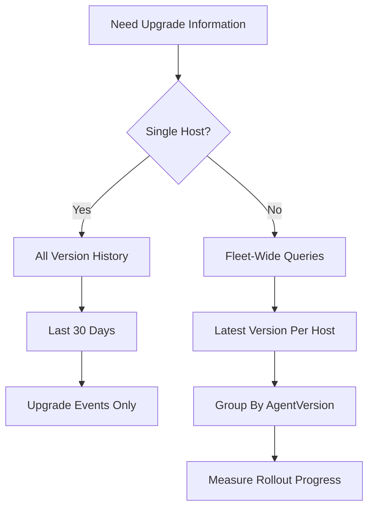

# CrowdStrike LogScale Queries – Agent Upgrade History

*A collection of useful LogScale queries for tracking CrowdStrike sensor upgrades and version history.*

---

# Overview

The `AgentOnline` event contains valuable information about sensor versions and upgrade history.

Useful fields include:

* `AgentVersion`
* `ConfigBuild`
* `BuildNumber`
* `ComputerName`
* `event_platform`
* `aid`

These queries can help:

* Investigate a single host
* Review historical upgrades
* Identify version changes
* Monitor rollout progress
* Determine fleet-wide sensor distribution

---

# AgentOnline Event

All queries below use:

```logscale
#event_simpleName=AgentOnline
```

---

# Single Host — All Version Fields

Displays all AgentOnline events for a specific host.

```logscale
#event_simpleName=AgentOnline
aid=<your_aid_here>
| sort(@timestamp, order=desc)
| table([@timestamp, ComputerName, ConfigBuild, AgentVersion, BuildNumber, event_platform])
```

### Use Cases

* Verify current version
* Review previous versions
* Troubleshoot upgrades

---

# Single Host — Last 30 Days

Restricts results to the last 30 days.

```logscale
#event_simpleName=AgentOnline
aid=<your_aid_here>
| @timestamp > now() - 30d
| sort(@timestamp, order=desc)
| table([@timestamp, ComputerName, ConfigBuild, AgentVersion, BuildNumber, event_platform])
```

### Use Cases

* Recent upgrade history
* Troubleshooting update failures
* Change validation

---

# Single Host — Show Upgrade Events Only

Displays only events where the sensor version changed.

```logscale
#event_simpleName=AgentOnline
aid=<your_aid_here>
| sort(@timestamp, order=asc)
| delta(AgentVersion, as=VersionChanged)
| VersionChanged != 0
| sort(@timestamp, order=desc)
| table([@timestamp, ComputerName, ConfigBuild, AgentVersion, BuildNumber, event_platform])
```

### Use Cases

* Upgrade timelines
* Confirming successful upgrades
* Historical change analysis

---

# Fleet-Wide Upgrade History

Shows AgentOnline events across all hosts.

```logscale
#event_simpleName=AgentOnline
| sort(@timestamp, order=desc)
| table([@timestamp, aid, ComputerName, ConfigBuild, AgentVersion, BuildNumber, event_platform])
```

### Use Cases

* Fleet investigations
* Upgrade validation
* Historical analysis

---

# Latest Version Per Host

Returns only the latest AgentOnline event for each host.

```logscale
#event_simpleName=AgentOnline
| groupBy([aid, ComputerName, event_platform], function=(
    selectFromMax(field="@timestamp", include=[@timestamp, ConfigBuild, AgentVersion, BuildNumber])
))
| sort(AgentVersion, order=desc)
| table([@timestamp, ComputerName, ConfigBuild, AgentVersion, BuildNumber, event_platform])
```

### Use Cases

* Current sensor inventory
* Compliance reporting
* Upgrade status checks

---

# Fleet-Wide Version Distribution

Groups hosts by sensor version.

```logscale
#event_simpleName=AgentOnline
| groupBy([aid, ComputerName], function=(
    selectFromMax(field="@timestamp", include=[AgentVersion, ConfigBuild, event_platform])
))
| groupBy([AgentVersion], function=(count(aid, as=HostCount)))
| sort(HostCount, order=desc)
| table([AgentVersion, HostCount])
```

### Use Cases

* Sensor Update Policy rollout tracking
* Upgrade adoption metrics
* Version distribution analysis

---

# Which Queries Are Most Useful?

| Query                            | Purpose                     |
| -------------------------------- | --------------------------- |
| Single Host – All Version Fields | Daily troubleshooting       |
| Single Host – Last 30 Days       | Recent changes              |
| Upgrade Events Only              | Historical upgrade timeline |
| Fleet-Wide Upgrade History       | Investigations              |
| Latest Version Per Host          | Current inventory           |
| Hosts Grouped By Version         | Rollout monitoring          |

---

# Typical Workflow



---

# Recommended Daily Queries

### Single Host Troubleshooting

```logscale
#event_simpleName=AgentOnline
aid=<your_aid_here>
| sort(@timestamp, order=desc)
| table([@timestamp, ComputerName, ConfigBuild, AgentVersion, BuildNumber, event_platform])
```

---

### Rollout Tracking

```logscale
#event_simpleName=AgentOnline
| groupBy([aid, ComputerName], function=(
    selectFromMax(field="@timestamp", include=[AgentVersion, ConfigBuild, event_platform])
))
| groupBy([AgentVersion], function=(count(aid, as=HostCount)))
| sort(HostCount, order=desc)
| table([AgentVersion, HostCount])
```

---

## Key Takeaways

* `AgentOnline` is the primary event for tracking sensor upgrades.
* Variants 1 and 2 are ideal for daily host-level checks.
* Variant 3 helps identify actual upgrade events.
* Variant 5 provides a current fleet inventory.
* Variant 6 is extremely useful for Sensor Update Policy rollout monitoring.
