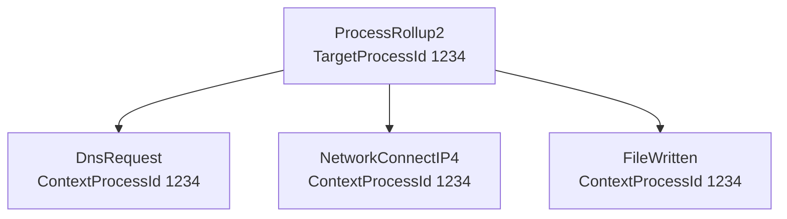
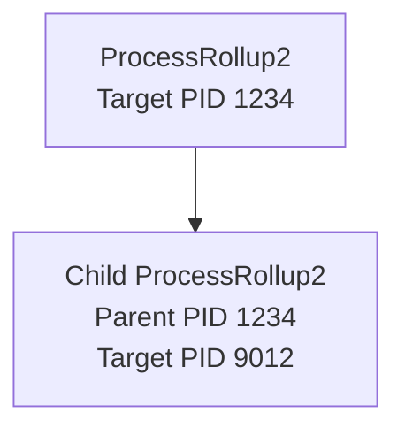
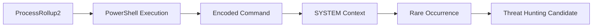

# CrowdStrike LogScale Query Deep Dive

> Study Notes for Falcon LogScale Query Building, ProcessRollup2 Analysis, and Investigation Workflows

---

# Basic Process Query Example

```logscale
#event_simpleName=ProcessRollup2 FileName=PING.EXE
| groupBy([ComputerName, FileName, CommandLine])
| sort([_count], order=desc)
```

### Host-Specific Version

```logscale
ComputerName="INL-1YTJ3F3"
#event_simpleName=ProcessRollup2 FileName=PING.EXE
| groupBy([ComputerName, FileName, CommandLine])
| sort([_count], order=desc)
```

---

# Understanding `event_simpleName`

**Field:** `event_simpleName`

**Purpose:** Identifies the event type generated by the Falcon sensor.

**Example:**

```text
ProcessRollup2
```

---

# Understanding ProcessRollup2

`ProcessRollup2` (commonly called **PR2**) is one of the most important CrowdStrike event types.

It is generated whenever a process starts or executes on a host and contains rich process telemetry used for:

- Process investigations
- Threat hunting
- Detection engineering
- Process tree reconstruction
- Incident response

For every ProcessRollup2 event there is a matching termination event:

| Platform | Termination Event |
|----------|------------------|
| Windows | EndOfProcess |
| macOS | EndOfProcess |
| Linux | TerminateProcess |

---

## Platform Support

ProcessRollup2 exists on:

- Windows
- macOS
- Linux

For Linux and macOS, additional process information is often stored in:

```text
ProcessRollup2Stats
```

---

# TargetProcessId_decimal

Every ProcessRollup2 event contains:

```text
TargetProcessId_decimal
```

Important facts:

- Generated internally by Falcon
- Unique per process instance
- Different from operating system PID
- Used to correlate process-related activity

Example:

Running:

```cmd
cmd.exe
```

twice creates:

```text
ProcessRollup2 #1
TargetProcessId_decimal = 1234

ProcessRollup2 #2
TargetProcessId_decimal = 5678
```

Even if Windows PID values appear similar, Falcon generates a unique internal process identifier.

---

# ContextProcessId_decimal

Processes generate many child events:

- DNS Requests
- Network Connections
- File Writes
- Thread Injection Events
- Registry Changes

To link those events back to the originating process Falcon uses:

```text
ContextProcessId_decimal
```

### Relationship



If:

```text
ContextProcessId_decimal == TargetProcessId_decimal
```

then the event belongs to that process.

---

# ParentProcessId_decimal

When a process creates another process, Falcon records:

```text
ParentProcessId_decimal
```

This field allows analysts to reconstruct parent-child relationships.

### Example



Relationship:

```text
Child.ParentProcessId_decimal
=
Parent.TargetProcessId_decimal
```

This is the foundation of process tree investigations.

---

# Frequently Used Event Names

## Process Events

```text
ProcessRollup2
SyntheticProcessRollup2
EndOfProcess
```

## File Events

```text
FileCreateInfo
FileDeleteInfo
FileRenameInfo
FileWritten
```

## Network Events

```text
DnsRequest
NetworkConnectIP4
```

## Registry Events

```text
AsepKeyUpdate
AsepValueUpdate
RegGenericValueUpdate
RegSystemConfigValueUpdate
```

## Device Events

```text
DcUsbDeviceConnected
```

## Snapshot Events

```text
VolumeSnapshotCreated
VolumeSnapshotDeleted
```

## Detection Events

```text
ProcessBlocked
AssociateIndicator
AssociateTreeIdWithRoot
```

---

# Query Building 101

## Golden Rule

Start your searches with a tagged field whenever possible.

Most commonly:

```logscale
#event_simpleName=ProcessRollup2
```

Why?

Because LogScale can immediately discard irrelevant data and dramatically improve query performance.

---

# Hunting Encoded PowerShell

## Step 1 – Find Windows Process Executions

```logscale
#event_simpleName=ProcessRollup2 event_platform=Win
```

---

## Step 2 – Find PowerShell Executions

```logscale
#event_simpleName=ProcessRollup2 event_platform=Win
| ImageFileName=/\\powershell(_ise)?\.exe/i
```

Matches:

```text
powershell.exe
powershell_ise.exe
```

The trailing:

```text
/i
```

makes the regex case-insensitive.

---

## Step 3 – Find Encoded Commands

```logscale
#event_simpleName=ProcessRollup2 event_platform=Win
| ImageFileName=/\\powershell(_ise)?\.exe/i
| CommandLine=/\-e(nc|ncodedcommand|ncoded)?\s+/i
```

Matches:

```text
-e
-enc
-encoded
-encodedcommand
```

---

# Extract Encoded Flag Used

```logscale
#event_simpleName=ProcessRollup2 event_platform=Win
| ImageFileName=/\\powershell(_ise)?\.exe/i
| CommandLine=/\-(?<encodedFlagUsed>e(nc|ncodedcommand|ncoded)?)\s+/i
```

Creates:

```text
encodedFlagUsed
```

Example output:

```text
enc
encodedcommand
encoded
```

---

# Restrict to SYSTEM Account

```logscale
#event_simpleName=ProcessRollup2 event_platform=Win
| ImageFileName=/\\powershell(_ise)?\.exe/i
| CommandLine=/\-(?<encodedFlagUsed>e(nc|ncodedcommand|ncoded)?)\s+/i
| UserSid="S-1-5-18"
```

`S-1-5-18` = Local SYSTEM

---

# Aggregate Results

```logscale
#event_simpleName=ProcessRollup2 event_platform=Win
| ImageFileName=/\\powershell(_ise)?\.exe/i
| CommandLine=/\-(?<encodedFlagUsed>e(nc|ncodedcommand|ncoded)?)\s+/i
| UserSid="S-1-5-18"
| groupBy([encodedFlagUsed, CommandLine], function=(count(aid, as=executionCount)))
| sort(executionCount, order=asc)
```

Purpose:

- Identify rare encoded PowerShell executions
- Surface unusual command lines
- Prioritize anomalies

---

# Search All Users

Comment out UserSid:

```logscale
#event_simpleName=ProcessRollup2 event_platform=Win
| ImageFileName=/\\powershell(_ise)?\.exe/i
| CommandLine=/\-(?<encodedFlagUsed>e(nc|ncodedcommand|ncoded)?)\s+/i
// | UserSid="S-1-5-18"
| groupBy([encodedFlagUsed, CommandLine], function=(count(aid, as=executionCount)))
| sort(executionCount, order=asc)
```

---

# Add Threshold Filtering

Only show commands observed less than 10 times:

```logscale
#event_simpleName=ProcessRollup2 event_platform=Win
| ImageFileName=/\\powershell(_ise)?\.exe/i
| CommandLine=/\-(?<encodedFlagUsed>e(nc|ncodedcommand|ncoded)?)\s+/i
| groupBy([encodedFlagUsed, CommandLine], function=(count(aid, as=executionCount)))
| test(executionCount < 10)
| sort(executionCount, order=asc)
```

Excellent technique for:

- Threat hunting
- Rare execution discovery
- Detection engineering

---

# Improve Readability

Trim long command lines:

```logscale
| format("%,.100s", field=CommandLine, as=CommandLine)
```

Benefits:

- Cleaner dashboards
- Easier investigations
- Better aggregation output

---

# Investigation Workflow



---

# Key Takeaways

1. ProcessRollup2 is the most important Falcon hunting event.
2. TargetProcessId_decimal uniquely identifies process instances.
3. ContextProcessId_decimal links events back to processes.
4. ParentProcessId_decimal enables process tree reconstruction.
5. Always start queries using tagged fields such as:
   ```
   #event_simpleName
   ```
6. Regex dramatically improves hunting flexibility.
7. Rare PowerShell executions often provide high hunting value.
8. Use aggregation and thresholds to reduce noise.
9. Process relationships are the foundation of Falcon investigations.
10. Think in terms of behavior chains, not isolated events.
