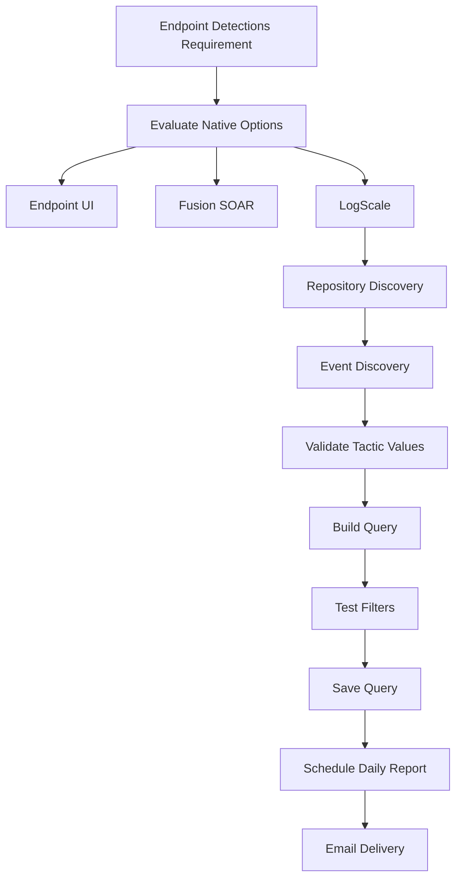

# CrowdStrike Next-Gen SIEM – AI-Powered IOA Detection Reporting

*A Field Learning Blog — From Falcon Console to LogScale Query*

**Author:** Peeyush Kumar Rao
**Platform:** CrowdStrike Falcon Next-Gen SIEM (LogScale)
**Date:** June 2026

---

# Problem Statement

The objective was to automate a daily detection report from CrowdStrike Falcon for:

* **Tactic:** AI Powered IOA
* **IOC Source:** Anomalous process execution
* **IOC Type:** Compounded behavioral activity

These filters are available under:

```
Endpoint Security → Monitor → Endpoint Detections
```

> Goal: Receive the filtered detection report daily via email without manually opening the Falcon console.

---

# Solutions Evaluated

| Method                   | Scheduled    | Email Delivery | Custom Filters | Verdict            |
| ------------------------ | ------------ | -------------- | -------------- | ------------------ |
| Endpoint Detections UI   | ✅            | ✅              | ✅              | Try first          |
| Fusion SOAR              | ❌ Event-only | Partial        | ❌              | Not suitable       |
| LogScale / Next-Gen SIEM | ✅            | ✅              | ✅              | Best native option |
| Python + FalconPy API    | ✅            | ✅              | ✅              | Fallback option    |

---

# Why Fusion SOAR Was Ruled Out

Fusion SOAR is reactive, not scheduled.

Limitations:

* Event-triggered workflows only
* No daily scheduler
* No native report generation
* No email-based tabular reports

> Fusion fires on events, not on a clock.

---

# Why LogScale Won

LogScale provides:

* Scheduled queries
* Native email delivery
* No infrastructure
* No custom scripts
* Fully managed inside Falcon

---

# Repository Discovery

Before writing queries, identify the correct repository.

Repositories found:

* All
* IT Automation
* Falcon ✅
* Third Party
* Forensics
* FCS Cloud Logs
* Risks
* Query Audit

> Endpoint detections live inside the **Falcon repository**.

---

# Why Querying "All" Is Slow

Using **All** forces cross-repository searches.

Advantages of using Falcon repository:

* Faster searches
* Better indexing
* Lower execution time

Typical performance:

| Scope            | Execution Time |
| ---------------- | -------------- |
| Falcon repo      | Seconds        |
| All repositories | 10+ minutes    |

---

# Event Discovery

The required event type:

```logscale
#event_simpleName=AssociateTreeIdWithRoot
```

Pattern mapping:

```logscale
| match(file="falcon/investigate/detect_patterns.csv", field=[PatternId])
```

Restrict to Falcon UI detections:

```logscale
| show_in_ui="True"
```

---

# Discovering Available Tactics

Rather than guessing values:

```logscale
#event_simpleName=AssociateTreeIdWithRoot
| match(file="falcon/investigate/detect_patterns.csv", field=[PatternId])
| show_in_ui="True"
| groupBy(Tactic)
```

Result:

```
AI Powered IOA
```

### Important Observation

LogScale uses:

```
AI Powered IOA
```

FalconPy API uses:

```
AI-Powered IOA
```

The strings are different.

---

# Final Working Query

```logscale
#event_simpleName=AssociateTreeIdWithRoot
| match(file="falcon/investigate/detect_patterns.csv", field=[PatternId])
| show_in_ui="True"
| Tactic="AI Powered IOA"
| table([
aid,
ComputerName,
Tactic,
Technique,
DetectDescription,
PatternId,
IOCSource,
IOCType
])
```

---

# Zero Result Investigation

Applying:

```
IOCSource = Anomalous process execution
IOCType = Compounded behavioral activity
```

returned:

```
0 results
```

Validation:

| Validation Step           | Result        | Conclusion       |
| ------------------------- | ------------- | ---------------- |
| LogScale query            | 0 results     | Not query syntax |
| Falcon UI                 | 0 results     | Data absent      |
| Query without IOC filters | 42 detections | Data exists      |

### Key Learning

Zero results in both LogScale and Falcon UI usually indicate:

> The data doesn't exist, not that the query is wrong.

---

# Recommended Next Step

Discover actual IOCSource values:

```logscale
#event_simpleName=AssociateTreeIdWithRoot
| match(file="falcon/investigate/detect_patterns.csv", field=[PatternId])
| show_in_ui="True"
| Tactic="AI Powered IOA"
| groupBy(IOCSource)
```

---

# Scheduling Reports

## Step 1 — Save Query

```
Investigate → Log Search
```

Set:

```
Last 24 Hours
```

Save as:

```
AI-IOA Daily Report
```

---

## Step 2 — Schedule

Configure:

* Daily
* 7 AM IST
* Email recipients
* CSV or PDF

---

## Step 3 — Optional Dashboard

Create dashboard widgets:

* Detection count
* Timeline
* Detection table

Dashboards can also be scheduled.

---

# Python Fallback

If LogScale scheduling isn't available:

Use FalconPy APIs:

```
/detects/queries/detects/v1
/detects/entities/summaries/GET/v1
```

Capabilities:

* Excel reports
* SMTP email delivery
* Cron scheduling
* Windows Task Scheduler
* Multi-CID support

Required scope:

```
Detections: Read
```

---

# Key Learnings

| Learning                              | Impact                      |
| ------------------------------------- | --------------------------- |
| Query specific repositories           | Faster execution            |
| Fusion SOAR is event driven           | No scheduled reports        |
| API and LogScale strings differ       | Prevents zero-result issues |
| Use groupBy() first                   | Discover actual values      |
| Zero results ≠ bad query              | Data may not exist          |
| LogScale scheduling is simplest       | No coding required          |
| show_in_ui=True aligns with Falcon UI | Better consistency          |

---

# Query Cheat Sheet

## List Event Types

```logscale
* | limit 100 | groupBy(#event_simpleName)
```

---

## List Tactics

```logscale
#event_simpleName=AssociateTreeIdWithRoot
| match(file="falcon/investigate/detect_patterns.csv", field=[PatternId])
| show_in_ui="True"
| groupBy(Tactic)
```

---

## List IOCSource Values

```logscale
#event_simpleName=AssociateTreeIdWithRoot
| match(file="falcon/investigate/detect_patterns.csv", field=[PatternId])
| show_in_ui="True"
| Tactic="AI Powered IOA"
| groupBy(IOCSource)
```

---

## Production Report Query

```logscale
#event_simpleName=AssociateTreeIdWithRoot
| match(file="falcon/investigate/detect_patterns.csv", field=[PatternId])
| show_in_ui="True"
| Tactic="AI Powered IOA"
| table([
aid,
ComputerName,
Tactic,
Technique,
DetectDescription,
PatternId,
IOCSource,
IOCType
])
```

---

# Workflow Diagram



---

# Final Thoughts

For scheduled Falcon detection reporting, **CrowdStrike Next-Gen SIEM (LogScale)** provides the cleanest native solution.

The biggest lesson learned was:

> Always discover actual field values with `groupBy()` before filtering, and always scope queries to the Falcon repository instead of querying **All**.

---
