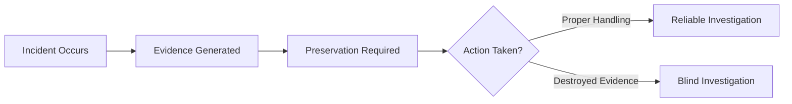
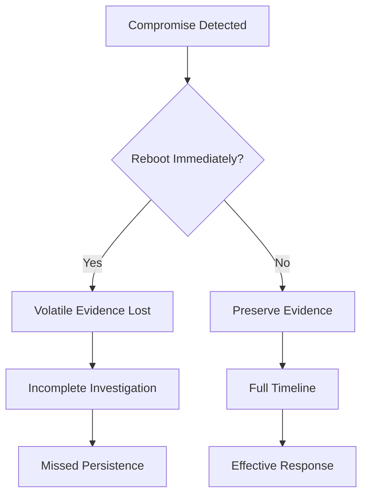

# Evidence Preservation & Why Not Reboot Immediately

## Evidence Preservation

Evidence preservation is the process of protecting and maintaining data integrity for investigation and response.

### Key Evidence Types

- Memory artifacts
- Process execution data
- Logs and timelines
- Disk artifacts

### CrowdStrike Perspective

Falcon preserves:

- Process Tree
- Command-line arguments
- Memory behavior (e.g., LSASS access)
- DLL loads (ImageLoad)
- Network connections
- Event timelines

---

## Evidence Types & Risk

| Type           | Example                  | Risk if Lost        |
|----------------|--------------------------|--------------------|
| Volatile       | Memory, processes        | Lost on reboot     |
| Semi-volatile  | Logs, temp files         | Overwritten        |
| Persistent     | Disk files               | Can be deleted     |

---

## Evidence Lifecycle



---

## Why You Should NOT Reboot Immediately

Rebooting destroys volatile evidence and disrupts investigation.

### What is Lost

- In-memory malware
- Injected processes
- Active network connections
- Credential artifacts (LSASS, tokens, hashes)

### Impact

- Breaks attack timeline
- Hides attacker activity
- Allows persistence to restart

---

## Example

```
powershell.exe → injected payload → LSASS access
```

After reboot:
- Payload gone
- Evidence gone
- Partial visibility

---

## Falcon Approach

Before reboot:

- Capture:
  - Process Tree
  - Timeline
  - Memory indicators

- Use:
  - Real Time Response (RTR)
  - Remote triage

- Perform:
  - Cross-host scoping

Then:
- Controlled containment
- Remediation

---

## Reboot vs Preserve Decision



---

## Interview Notes

- Order of volatility (RAM first)
- Hash validation (SHA-256)
- RAM-only malware awareness
- Adversary OPSEC considerations
- SSD TRIM risk

---

## Key Takeaway

- Do not reboot immediately
- Preserve volatile evidence first
- Investigate before containment
