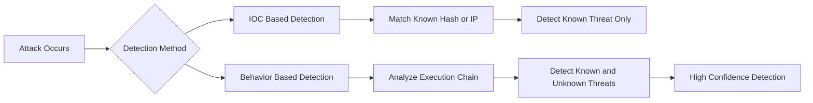

# What is an IOC and why are IOCs insufficient?

## Definition

An Indicator of Compromise (IOC) is a specific observable artifact that suggests malicious activity.

Examples:
- File hashes
- IP addresses
- Domain names
- File paths

---

## Key Idea

IOCs tell you **something happened**, but not:
- What exactly happened
- Why it happened
- How serious it is

---

## Why IOCs Are Insufficient

### 1. Easily Changed
- Malware can be recompiled → new hash
- Infrastructure can rotate → new IP/domain

---

### 2. No Context

Example:
powershell.exe → connects to IP

Unknown:
- Was it malicious?
- Was it admin activity?

---

### 3. Misses Modern Attacks

- Fileless malware
- Living-off-the-Land (LOLBins)
- In-memory execution

No file → no hash → no IOC

---

### 4. Reactive Only

- Detects known threats
- Fails against:
  - New malware
  - Custom tools
  - Zero-days

---

## CrowdStrike Perspective

IOCs = supporting signals  
IOAs = primary detection

Falcon focuses on:
- Process behavior
- Command-line activity
- Parent-child relationships
- Memory access

---

## Example (Behavior-Based Detection)

winword.exe → powershell.exe → encoded command → LSASS access

- No IOC required
- Behavior proves compromise

---

## Mermaid: IOC vs Behavior Detection

---

## Mock Scenario

### IOC-Based Failure
- No hash match found
- Analyst assumes system is safe

Reality:
- Malware is polymorphic
- Hash changes every time

---

### Behavior-Based Success

Detection:
vssadmin.exe delete shadows

Outcome:
- Attack detected during execution
- True positive confirmed

---

## Key Takeaway

- IOCs are **reactive**
- IOAs are **behavioral**
- Detection must focus on **how attackers operate**, not just artifacts
