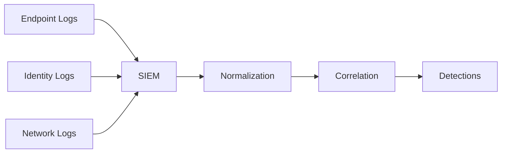
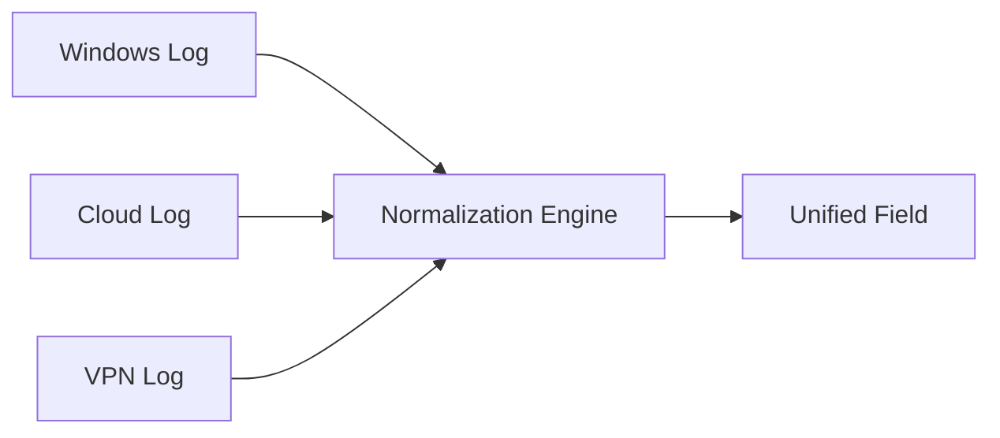
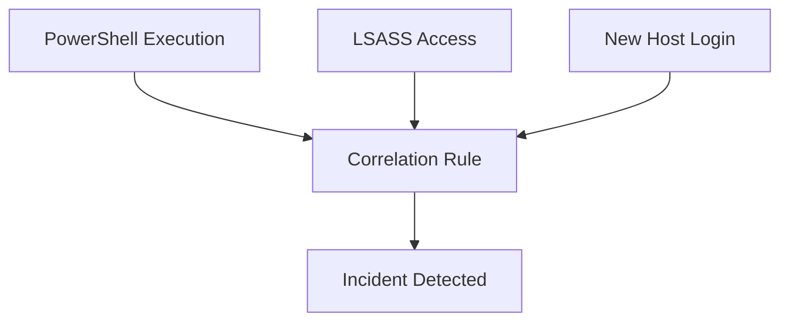
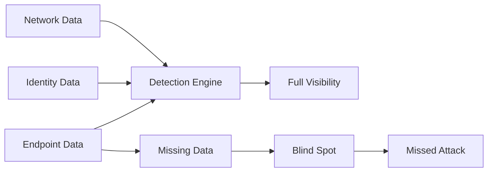

# SIEM, Log Normalization, Correlation Rules & Telemetry Blind Spots

## What is a SIEM?

A SIEM collects, normalizes, correlates, and analyzes logs from multiple sources.

It solves:
- Fragmented visibility
- Manual log analysis
- Lack of centralized detection

---

## Mermaid: SIEM Role

---

## What is Log Normalization?

Log normalization converts different log formats into a standard structure.

Example:
- user=admin
- username=admin
- usr=admin

→ normalized → user=admin

---

## Mermaid: Normalization

---

## What is a Correlation Rule?

A correlation rule links multiple events to detect attack patterns.

Example:
- PowerShell execution
- LSASS access
- New login

→ Combined → Incident

---

## Mermaid: Correlation

---

## Why Missing Telemetry Creates Blind Spots

Missing telemetry means missing visibility.

You cannot detect what you cannot see.

---

## Examples

### No Endpoint Data
- No process visibility
- No command-line visibility
- No memory detection

---

### No Identity Data
- No login tracking
- No credential abuse detection

---

### No Network Data
- No C2 detection
- No exfiltration detection

---

## Mermaid: Blind Spot

---

## Key Takeaway

- SIEM = aggregation + normalization + correlation
- Normalization = standard format
- Correlation = attack detection logic
- Missing telemetry = blind spots
