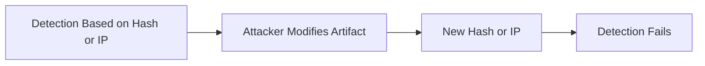
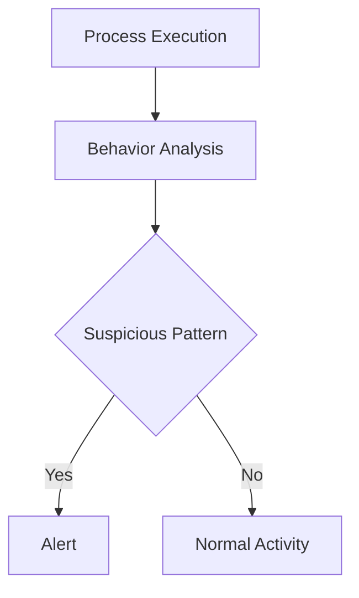
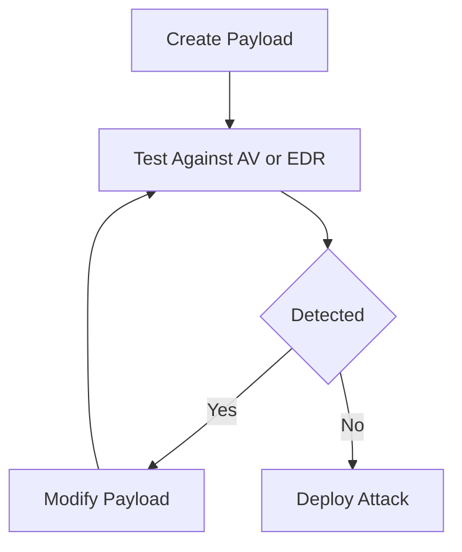

# Static vs Behavioral Detection

## Why do static detections fail over time?

Static detections rely on fixed artifacts:
- Hashes
- IPs
- Domains
- Signatures

These fail because attackers can change artifacts without changing behavior.

---

## Key Insight

Artifacts change quickly  
Techniques remain consistent

---

## Real SOC Examples

### Recompilation
malware_v1.exe → hash A (detected)  
malware_v2.exe → hash B (undetected)

### Infrastructure Rotation
- New IP/domain
- Use of cloud/CDN

### Fileless Attacks
- No file
- No hash
- No signature

---

## Mermaid: Why Static Detection Fails

---

## What is Behavioral Detection?

Behavioral detection focuses on what a process does:
- Process chains
- Command-line usage
- Memory access
- Privilege behavior

---

## Example (High-Signal Behavior)

winword.exe → powershell.exe → LSASS access

- No known malware required
- Behavior itself is malicious

---

## Mermaid: Behavioral Detection

---

## Static vs Behavioral

| Static Detection | Behavioral Detection |
|-----------------|---------------------|
| Based on artifacts | Based on behavior |
| Reactive | Proactive |
| Easy to evade | Hard to evade |
| Fragile | Durable |

---

## Why attackers evade signature-based detection

Attackers evade static detection because:
- It is predictable
- It is artifact-based
- It is easy to bypass

---

## How attackers evade

### Modify Artifacts
- Change hash
- Change domain

### Use LOLBins
- powershell.exe
- rundll32.exe
- mshta.exe

### Go Fileless
- In-memory execution
- Reflective loading

### Pre-test Payloads
- Tested against AV/EDR before deployment

---

## Mermaid: Attacker Evasion Loop

---

## Key Takeaway

- Static detection is fragile and short-lived  
- Behavioral detection is durable and high-signal  
- Modern SOC detection must focus on behavior
