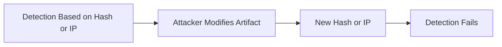
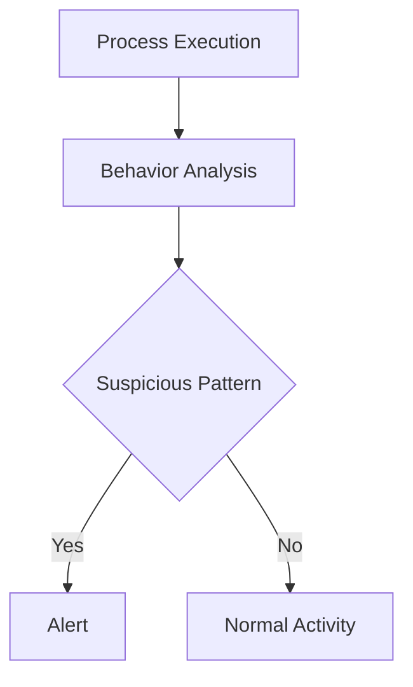
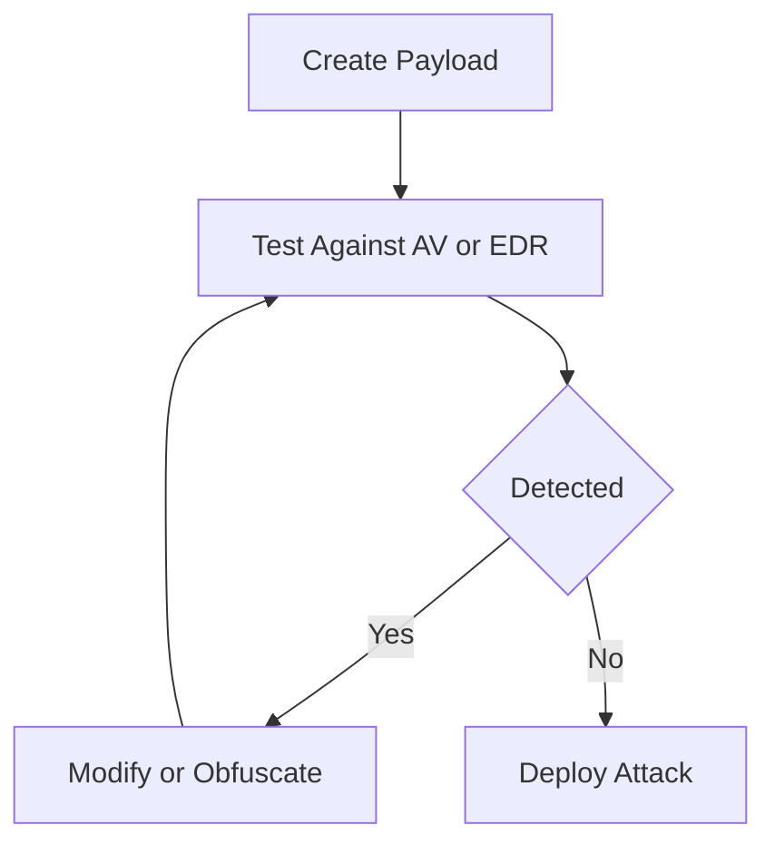

# Static Detection vs Behavioral Detection (Full Notes)

## 40. Why do static detections fail over time?

Static detections, also known as signature-based detections, rely on databases of known attack patterns, file hashes, or vulnerabilities. They fail over time because they can only identify threats for which a specific signature has already been created.

Because the threat landscape evolves rapidly, vendors must constantly discover new malware, extract signatures, and distribute updates. If a signature database is outdated, or if attackers use zero-day exploits, static detection fails completely.

---

## 41. What is behavioral detection?

Behavioral detection is a proactive approach that observes how a program executes rather than matching static code.

It analyzes:
- Process behavior
- System changes
- Execution patterns

It detects:
- Code unpacking
- Host file modification
- Keystroke monitoring

Because it focuses on actions and intent, it can detect unknown threats without signatures.

---

## 42. Why do attackers evade signature-based detection?

Attackers evade signature-based detection because:
- It is brittle
- Small changes break detection

Techniques used:
- Polymorphic malware (changes every execution)
- Code obfuscation
- Payload testing against AV/EDR

Attackers often validate payloads before deployment to ensure they are undetectable.

---

# Deep SOC / IR View

## Why static detections fail

Static detections rely on:
- Hashes
- IPs
- Domains
- Signatures

### Key Insight
Artifacts change quickly  
Techniques remain consistent

---

## CrowdStrike Perspective

Static detections are:
- Low durability
- Easily evaded
- Supportive, not primary

---

## Real SOC Examples

### 1. Recompilation

malware_v1.exe → hash A (detected)  
malware_v2.exe → hash B (undetected)

---

### 2. Infrastructure Rotation

- Change IP/domain → IOC invalid
- Use cloud/CDN → harder to block

---

### 3. Fileless Attacks

- No file
- No hash
- No signature

---

## Mermaid: Why Static Detection Fails

---

# Behavioral Detection

Behavioral detection identifies threats based on actions, not files.

Focus areas:
- Process chains
- Command-line activity
- Memory access
- Privilege usage

---

## CrowdStrike Perspective

Falcon uses IOAs (Indicators of Attack)

### Example

winword.exe → powershell.exe (encoded) → lsass.exe access

- No IOC required
- Behavior proves compromise

---

## Comparison

| Static Detection | Behavioral Detection |
|-----------------|---------------------|
| What it is | What it does |
| Fragile | Durable |
| Reactive | Proactive |
| Easy to evade | Hard to evade |

---

## Mermaid: Behavioral Detection

---

# Why attackers evade signature-based detection

## Model Answer

Attackers evade signature-based detection because:
- It is predictable
- It is artifact-based
- It is easy to bypass with minor changes

---

## CrowdStrike Perspective

Modern attackers design operations specifically to avoid static detection.

---

## How attackers evade

### 1. Modify Artifacts

- Change hash → bypass AV
- Change domain → bypass IOC

---

### 2. Use LOLBins

- powershell.exe
- rundll32.exe
- mshta.exe

No malware required → no signature

---

### 3. Fileless Techniques

- In-memory execution
- Reflective DLL loading
- Token abuse

---

### 4. Pre-Test Payloads

Attackers test against:
- AV engines
- EDR sandboxes

Only deploy when undetected

---

## Mermaid: Attacker Evasion Loop

---

## Final Takeaway

- Static detection is fragile and reactive
- Behavioral detection is durable and proactive
- Modern SOC must focus on attacker behavior, not artifacts
