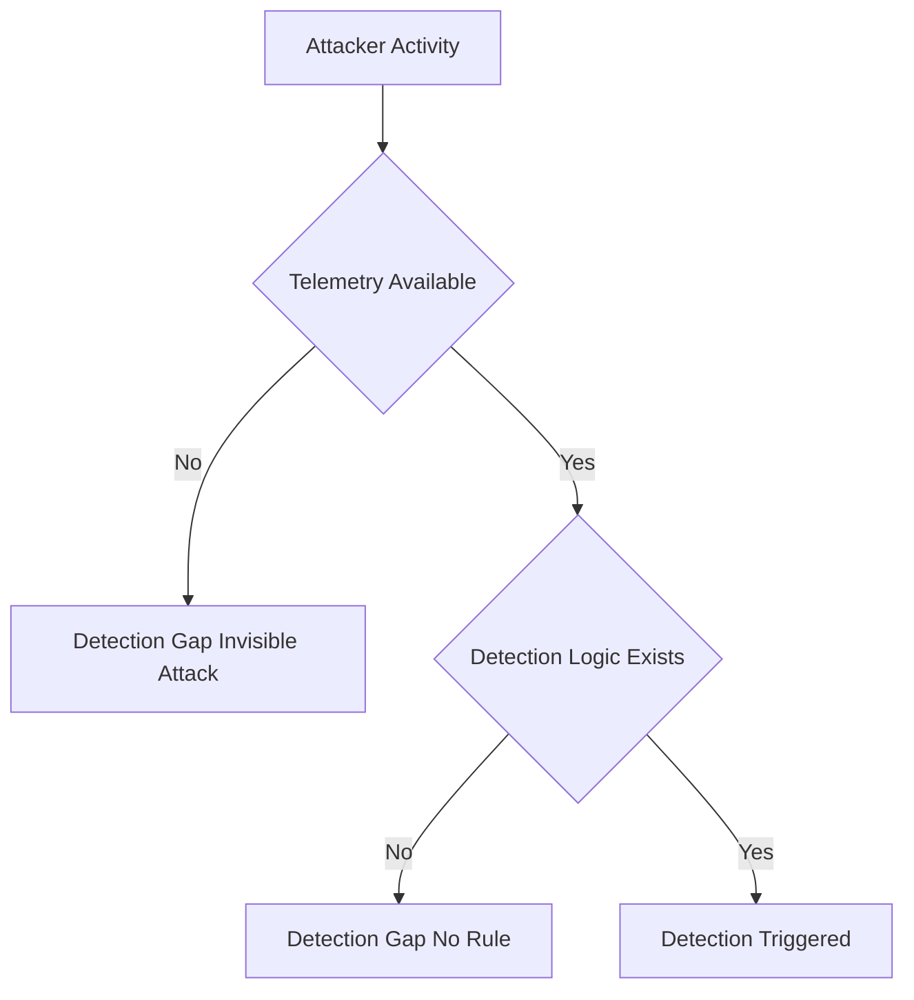
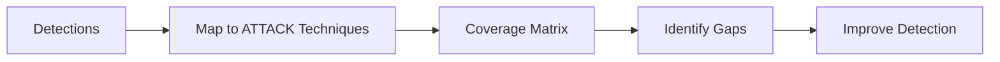
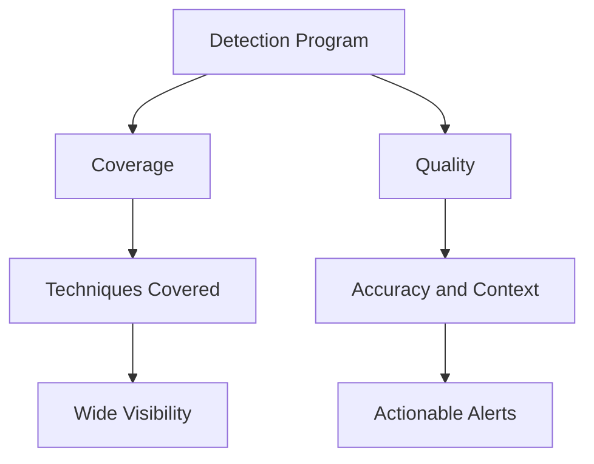

# Detection Gaps, MITRE ATT&CK Mapping, and Detection Coverage vs Quality

---

## What is a Detection Gap?

### Definition (Interview Answer)
A detection gap is a lack of visibility or detection capability for a specific attacker behavior or technique, meaning an attacker can perform that activity without triggering any alert.

In short:
A detection gap is where attackers can operate undetected.

---

## Deep Explanation

A detection gap is a blind spot in an organization's security posture where preventive or detective controls fail to identify a specific attack vector or adversary behavior. These gaps occur when:
- There is inadequate logging visibility
- Detection rules do not account for new attack techniques
- Security tools are improperly configured

Security teams proactively discover these gaps through:
- Threat hunting
- Red team adversary emulation
- Continuous security validation

Once identified, gaps must be remediated by:
- Creating new detection rules
- Acquiring required telemetry
- Mitigating risk via hunting or controls

---

## Key Concepts
- Visibility gaps = no telemetry
- Logic gaps = no detection rule
- Design gaps = weak or noisy detections

---

## CrowdStrike Perspective

Detection gaps in Falcon typically arise from:

### 1. Missing Telemetry
- No process logging
- No command-line visibility
- No identity logs  
→ You cannot see the attack

### 2. Missing Detection Logic
- Data exists, but:
  - No IOA
  - No rule
  - No correlation

### 3. Weak Detection Design
- Too noisy → disabled
- Too narrow → bypassed

---

## Example / Scenario

Attack:
rundll32.exe → malicious.dll (AppData)

If:
- No DLL load visibility
- No rule for suspicious path

Result:
Silent execution → Detection gap

---

## Mermaid: Detection Gap

---

## Detection / Investigation Notes
- Always ask: “Do we even see this?”
- Then: “Do we detect it?”
- Gaps often exist in:
  - Identity logs
  - Command-line visibility
  - Cross-host correlation

---

## Key Takeaway
- Detection gaps are inevitable
- Mature SOCs proactively find and close them
- Visibility + logic = detection

---

# Why Map Detections to MITRE ATT&CK?

### Definition (Interview Answer)
Mapping detections to MITRE ATT&CK provides a standardized way to measure detection coverage against real adversary techniques.

In short:
MITRE mapping turns detection into measurable coverage.

---

## Deep Explanation

MITRE ATT&CK provides a universal language based on real-world attacker behavior (TTPs). Mapping detections to ATT&CK allows organizations to:
- Understand what techniques they detect
- Identify what techniques they miss
- Align threat intelligence, red team, and blue team

It transforms detection into a strategic, measurable program.

---

## Key Concepts
- ATT&CK = adversary behavior model
- Mapping = visibility of strengths & gaps
- Not a checklist — a framework for strategy

---

## CrowdStrike Perspective

Falcon aligns detections to ATT&CK to enable:

### 1. Coverage Visibility
- Can we detect:
  - Credential dumping?
  - Lateral movement?
  - Persistence?

### 2. Gap Identification
Example:
No detection for T1003 → critical gap

### 3. Standardized Language
- SOC, IR, Red Team, Threat Intel use same vocabulary

### 4. Detection Maturity
- Move from tool-based → adversary-based detection

---

## Example / Scenario

Red team executes:
- Credential dumping (T1003)

Blue team:
- Detects execution
- Misses credential access

Result:
Gap identified → detection created

---

## Mermaid: MITRE Mapping

---

## Detection / Investigation Notes
- Always map detections to ATT&CK technique IDs
- Helps prioritize high-risk gaps
- Enables measurable security posture

---

## Key Takeaway
- Without ATT&CK mapping, you don’t know what you’re missing
- Mapping enables structured detection engineering
- It aligns all security teams

---

# Detection Coverage vs Detection Quality

### Definition (Interview Answer)
Detection coverage is the breadth of techniques you can detect, while detection quality is how accurately and effectively those detections work.

In short:
Coverage is breadth; quality is depth.

---

## Deep Explanation

Detection coverage:
- Measures how many ATT&CK techniques are covered
- Focuses on visibility across environment

Detection quality:
- Measures accuracy and usefulness
- Focuses on:
  - True positives
  - Low false positives
  - Context-rich alerts

An organization may have:
- High coverage but poor quality → alert fatigue
- High quality but low coverage → missed attacks

---

## Key Concepts
- Coverage = scope
- Quality = fidelity
- Both must be balanced

---

## CrowdStrike Perspective

### Detection Coverage (Breadth)
- % of ATT&CK techniques covered
- Wide visibility reduces blind spots

### Detection Quality (Depth)
- Accuracy
- Context
- Actionability
- Confidence

---

## Example / Scenario

| Scenario | Coverage | Quality |
|---------|---------|--------|
| Alert on powershell.exe | High | Low |
| Encoded PS + parent + LSASS | Medium | High |

---

## Mermaid: Coverage vs Quality

---

## Detection / Investigation Notes
- High noise = poor quality
- Missing techniques = poor coverage
- Best detections:
  - Context-rich
  - Behavior-based
  - Low false positives

---

## Key Takeaway
- High coverage + low quality = alert fatigue
- Low coverage + high quality = missed attacks
- Goal: High coverage + high quality
